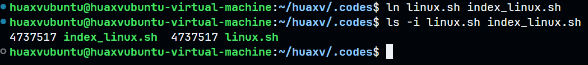

# Shell

## 简单入门

```bash
#!/bin/bash

echo "hello world";
```

## 关机

```bash
# 立刻关机
poweroff

# 立刻关机
hudo halt

# 23:30 才关机
sudo shutdown -h 23:30
```

## 重启

```bash
reboot

# 23:30 才重启
sudo shutdown -r 23:30
```

## 修改用户名

```bash
# 找到用户名并修改
vim /etc/shadow
vim /etc/group

reboot
```

## 取变量值

```bash
# 取变量值
$var

#统计个数
$#vars
```

## 控制结构

```bash
if 条件; then
    语句
elif 条件; then
    语句
else 
    语句
fi;
```

```bash
for 变量名 in 列表; do
    语句
done;
```

```bash
for ((语句; 语句; 语句)); do
    语句
done;
```

```bash
while 条件; do
    语句
done;
```

## tree

```bash
# 显示目录树
# 限制 3 层显示目录树
tree -L 3 dir_name
```

## pwd

```bash
# 显示当前的工作目录
pwd
```

## ls

```bash
# 列出目录和文件
ls -F dir_name

# 列出最详细的信息
ls -l dir_name 

# 列出文件的大小
ls -h dir_name
```

## cat

```bash
# 显示出 f1 f2 f3 的文件内容
cat f1 f2 f3
```

## mkdir

```bash
# 创建文件夹
mkdir dir

# 递归创建文件夹
mkdir -p dir/dir/dir
```

## rm

```bash
# 删除文件夹
rm -r dir 

# 强制删除文件夹
rm -rf dir 

# 强制删除文件
rm -f file
```

## cp

```bash
# 递归复制目录，将 dir1 复制进 dir2 里面
cp -r dir1 dir2 # dir2/dir1

# 强制复制
cp -rf dir1 dir2 
```

## mv

```bash
# 强制移动，将 dir1 移动到 dir2 里面
# 如果 dir2 不存在就是改名
mv -f dir1 dir2
```

## touch 

```bash
# 创建空文件，如果文件存在不执行如何操作
touch file

# 修改文件时间
touch -d "2017-10-05" file
touch -d "YYYY-MM-DD HH:MM:SS" file
```

## find

```bash
# 在 dir 文件夹里查找权限为 777 的文件
find dir -perm 777

# 在 dir 文件夹里查找名称为 name 的文件
# find . -name *
find dir -name name

# 按照大小查找文件
# 查找 dir 目录下大小超过 100 MB 的文件
# M、k、c 分别代表 MB、kB、cB
find dir -size +100M
find dir -size -100M
```

## 默认变量

```bash
# 当前文件名（包括文件所在路径）
$0

# 传入的参数个数
$#

# 传入的参数下标从 1 开始计起一直到 $#
$1、$2、$3、... 、${$#}

# 进程 id
$$

# 返回 command 的 stdout
$(command)
```

## 反引号变量

```bash
`command` # 捕获 command 的 stdout

# 同样作用
$(command)
```

## 只读变量

```bash
declare -r 变量
```

## 删除变量

```bash
unset 变量
```

## 临时环境变量

```bash
declare -x 变量

declare +x 变量 # 变为普通变量
```

### 字符串

```bash
str="hello world"
echo ${#str} # 11，输出字符串的长度

echo ${str:1:9} # 从 1 开始，提取 9 个字符: ello worl
```

## 数组

```bash
list=('c' 'c++' 'python' 'java' 'go' 'javascript')

for i in ${list[*]}; do 
    echo ${i};
done;

echo ${list[0]}
echo ${#list[*]}
```

## 判断语句

测试参数：

```bash
# 文件、文件夹
-e  # 判断文件是否存在
-f  # 判断是否是文件，如果不存在也是 false
-d  # 判断是否为目录，如果不存在都是 false

-r  # 文件是否可读
-w  # 文件是否可写
-x  # 文件是否可执行
-s  # 文件是否为空

# 比较大小
-eq # a -eq b 判断 a 是否等于 b
-ne # no equal
-gt # 大于
-lt # 小于
-ge # 大于等于
-le # 小于等于

# 字符串比较
-z string       # 判断是否为空
-n string       # 判断是否非空
str1 == str2    # 判断字符串是否相同
str1 != str2    # 判断字符串不相同
```

介绍 `test` 和「中括号」比较命令：

```bash
if [ `pwd` == '/home/huaxvubuntu/huaxv/.codes' ]; then 
    echo "the path is .codes"
fi;

if test `pwd` == '/home/huaxvubuntu/huaxv/.codes'; then
    echo "the path is .codes"
fi;
```

经验之谈：变量最好用双引号括起来，不然容易出现空格问题

```bash
run="python3 -u main.py"
if [ $run == "python3 -u main.py" ]; then
    echo "accept"
else echo "error";
fi; # 报错

# 等价于：
if [ python3 -u main.py == "python3 -u main.py" ]; then
    echo "accept"
else echo "error";
fi; # 报错

# 正确写法：
run="python3 -u main.py"
if [ "$run" == "python3 -u main.py" ]; then
    echo "accept"
else echo "error";
fi;
```

## 循环遍历

输出 1 到 10：

```bash
for ((i=1; i<=10; i ++)); do
    echo $i;
done;

for i in {1..10}; do
    echo $i;
done;

for i in {a..z}; do
    echo $i;
done;
```

## 函数

```bash
#!/bin/bash

func() {
    for i in $(seq 1 $1); do # $1、$2、$n 代表函数传入的参数
        for j in $(seq 1 $i); do
            printf "%d*%d=%-2d " $j $i `expr $i \* $j`
        done;
        printf "\n";
    done;
    return 256 # 取值范围：0 ~ 255，256 -> 0
}

func 10

echo $? # 捕获函数的放回值

echo "$(func 10)"

echo "`func 10`"

# echo 双引号中的换行符才会生效
```

## ln 软硬链接

### 硬链接

硬链接只能对文件创建一个硬链接

文件名其实都是一个文件指针，其文件地址也成为文件索引，可以用命令 `ls -i file` 来查看文件地址

而硬链接就是新建一个文件指针指向该索引，相当于是取了一个别名

但是文件的硬链接只能保存在同等目录下

如果删除了某个文件指针，文件并不会被删除，只有当所有的文件指针都被删除，文件才会被删除

可以实现一个备份功能，或者取一个别名的功能

```bash
ln file index_file

ls -i linux.sh index_linux.sh
```



### 软连接

软连接是硬链接的升级版，取消了只能在同等目录下创建的限制

软连接更像是 window 系统的快捷键

可以对文件、文件夹创建软连接

但是，如果源文件已经被删除，那么软连接也将失效

```bash
ln -s file index_file

ln -s dir index_dir

ls -i dir index_dir
```

## 进程

### 查看进程 pid

```bash
ps -elf
```

### 杀掉某进程

```bash
kill 进程的pid
```
