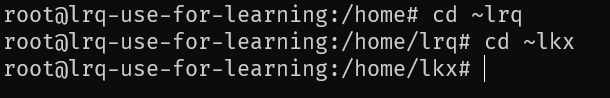

# linux 学习笔记

## 查看 linux 文件属性

查看当前目录下所有文件的属性

```bash
ls -al
```


---

查看某个文件或者目录的属性


```bash
ls -l [file folder]

# 或者
ll
```


---

文件权限图解：


file type:

- `d` 代表目录
- `-` 代表文件
- `l` 链接属性
- `b` 可存储设备
- `c` 鼠标、键盘等

第一组 `rwx` 代表『文件所有者』的权限，如果没有读写权限就变成了 `-wx` 用横杆代替

第二组 `rwx` 代表『同群组』的权限

第三组 `rwx` 代表其『非本群组』所拥有的权限

## 改变所属群组

```bash
chgrp -R 群组名 [file folder]
```

## 改变文件所有者

改变文件或文件夹的所有者

```bash
chown -R 用户名 [file folder]
```

不仅可以改变所有者，还可以改变所属群组

```bash
chown -R 用户名:群组名 [file folder]
```

## 更改文件权限

假设，需要将文件权限设定为：`rwxrwxrwx`

```bash
chmod -R 777 [file folder]
```

---

另外一种方法，单独修改某一项权限：

```bash
chmod -R u+x [file folder]
```


## 可执行文件


在 windows 中，文件是否具有可执行能力，是籍由『扩展名』来判断的

但是在 linux 中，文件是否可执行，则是籍由是否具有『x』属性所决定，与扩展名没有任何关系

在 linux 中，一个的文件的扩展名是什么，linux 并不关心，更确切的说，linux 并没有扩展名的概念

在 linux 里面，扩展名只是方便读者了解该文件的用途而已

## 一些特殊目录的常识

`/bin` 存放很多执行文件的地方

`/boot` 放置开机时需要使用的文件等

`/dev` 任何装置和接口都是以文件的形式存放此处

`/etc` 系统的主要配置文件都存放于此

`/etc/init.d` 所有服务的预设启动脚本都存放于此

---

`/home` 此处存放所有用户的家目录

可以使用 `cd ~` 到当前用户的家目录，或者使用 `cd ~用户名` 到达指定用户的家目录



---

`/root` 系统管理员的家目录


## 切换路径

- `cd -` 切换到上一次的工作目录
- `cd .` 切换到当前目录
- `cd ..` 切换到上一级目录
- `cd ~` 切换到当前用户的家目录
- `cd ~用户名` 切换到某用户的家目录


## 查找目录或文件

```bash
find -name [file folder]
```

## tar 压缩

### 打包成 .tar 文件

```bash
tar -cv -f name.tar 文件或文件夹
```

### 压缩成 .tar.gz 文件

```bash
tar -cz -f name.tar.gz 文件或文件夹
```

## tar 解压

### 解包 .tar 文件

```bash
tar -xv -f name.tar
```

### 解压 .tar.gz 文件

```bash
tar -xzv -f name.tar.gz
```
