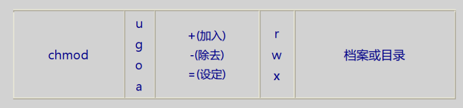

# linux 学习笔记

## 查看 linux 文件属性

查看当前目录下所有文件的属性

```bash
ls -al
```


---

查看某个文件或者目录的属性


```bash
ls -l [file folder]
```


---

文件权限图解：


file type:

- `d` 代表目录
- `-` 代表文件
- `l` 链接属性
- `b` 可存储设备
- `c` 鼠标、键盘等

第一组 `rwx` 代表『文件所有者』的权限，如果没有读写权限就变成了 `-wx` 用横杆代替

第二组 `rwx` 代表『同群组』的权限

第三组 `rwx` 代表其『非本群组』所拥有的权限

## 改变所属群组

```bash
chgrp -R 群组名 [file folder]
```

## 改变文件所有者

改变文件或文件夹的所有者

```bash
chown -R 用户名 [file folder]
```

不仅可以改变所有者，还可以改变所属群组

```bash
chown -R 用户名:群组名 [file folder]
```

## 更改文件权限

假设，需要将文件权限设定为：`rwxrwxrwx`

```bash
chmod -R 777 [file folder]
```

---

另外一种方法，单独修改某一项权限：

```bash
chmod -R u+x [file folder]
```




