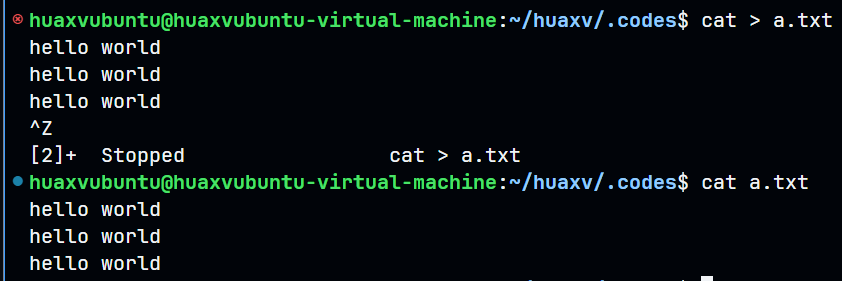
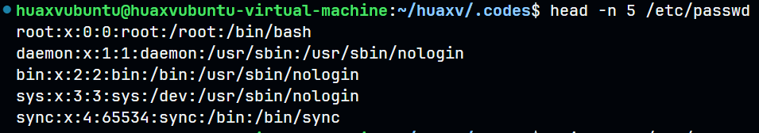
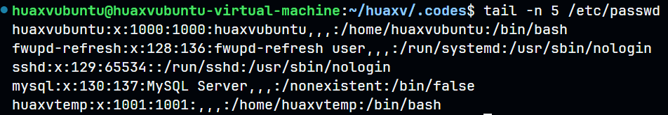
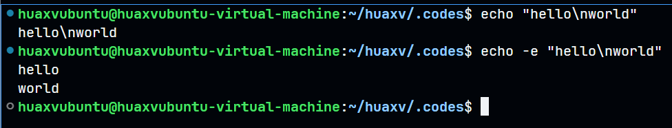

# linux 实验

## cat 从键盘输入内容

```bash
cat > a.txt
```



```bash
## 最加的方式输入
cat >> a.txt
```

## cat 合并文件内容并生成新文件

```bash
cat f1.txt f2.txt > f3.txt
```


## more、less 显示文件内容

```bash
more /etc/passwd

less /etc/passwd

# 效果和 cat 差不多
```

## 显示头前 5 行

```bash
head -n 5 /etc/passwd
```


## 显示尾后 5 行

```bash
tail -n 5 /etc/passwd
```



## echo 转义功能输出

```bash
echo "hello\nworld"

echo -e "hello\nworld"
```



## 目录显示、创建、移动、复制及命令 ls、pwd、cd 的用法


```bash
mkdir d1 d2 d3 d4
cat > d1/a1.txt
touch d1/a2.txt
cat > d1/a3.txt
mv d1/a1.txt d1/.a1.txt
mkdir -p d1/d11 d1/d12
echo "hello world" > d2/a1.txt
echo "hello world" > d2/a3.txt
```

```bash
ls -raF

ls -la

ls -larF

ls -i
```

为文件夹建立符号链接

```bash
ln -s dir1 dir13
```
