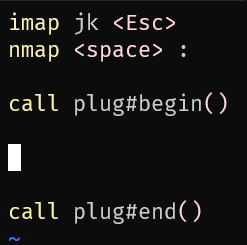

# neovim

## 安装 neovim

```bash
sudo apt-get-repository ppa:neovim-ppa/stable
sudo apt-get update
sudo apt-get install -y neovim
```

## 普通模式下

### 上下左右

```
h       左

j       下

k       上

l       右
```

### 多行跳跃、多格跳跃

```
4h      向左边跳 4 格

4j      向下跳 4 行

4k      向上跳 4 行

4l      向右跳 4 格
```

### 单词跳跃

```
b       上一个单词，last beginning

w       下一个单词，next word
```

### 回到文档的最上方

```
gg      回到文档的最上方
```

### 回到文档的末尾

```
G       到文档的末尾
```

### 翻页

```
ctrl + u    向上翻页

ctrl + d    向下翻页
```

### 到下一个字母处

```
fr      到下一个字符 r 处

fl      到下一个字符 l 处
```

### 复制

```
yaw     复制整个单词


y4j     向下复制 4 行


y4k     向上复制 4 行
```

### 删除

```
daw     删除整个单词


d4j     向下删除 4 行


d4k     向上删除 4 行
```


### 撤销

```
u       撤销
```

### 进入选中模式

```
v       进入选中模式
```

### 多行注释

```
ctrl + v 有时候是 ctrl + q

选中要注释的多行，输入大写：『I』

输入注释字符，然后按两次 esc 键
```

## 配置文件

```bash
mkdir ~/.config/nvim
nvim ~/.config/nvim/init.vim
```

修改键位

```bash
imap jk <Esc>
nmap <space> :
set number
```

## 下载插件

安装 `git`

```bash
sudo apt install git-all
```

---

下载 `vim plug`

```bash
sh -c 'curl -fLo "${XDG_DATA_HOME:-$HOME/.local/share}"/nvim/site/autoload/plug.vim --create-dirs \
       https://raw.githubusercontent.com/junegunn/vim-plug/master/plug.vim'
```

---

在配置文件中加入两行：

```bash
call plug#begin()

call plug#end()
```




---

[插件下载网站](https://vimawesome.com/)

```
https://vimawesome.com/
```
