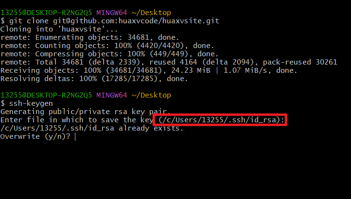
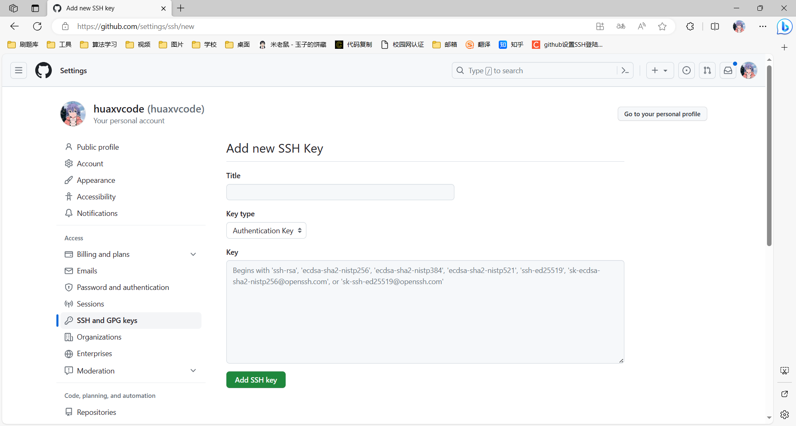

# git ssh

## 生成 ssh 公私钥

打开 `git bash`，输入：

> `ssh-keygen`



## github 添加公钥



## 登录

```shell
git config --global user.email "spydercoder@qq.com"

git config --global user.name "huaxv-code"
```
