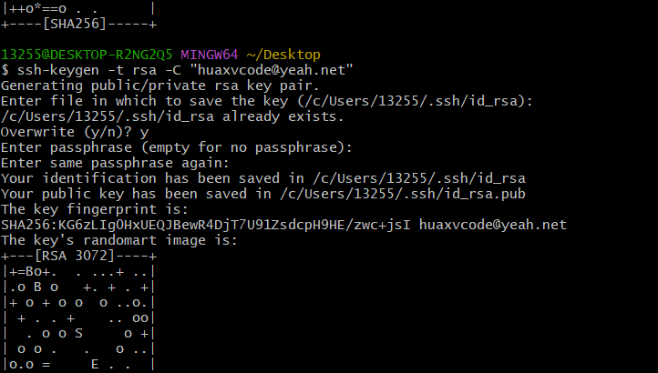

# git ssh

## 设置用户名

```shell
git config --global user.email "huaxvcode@yeah.net"

git config --global user.name "huaxvcode"

git config --list
```

## 生成 ssh 公私钥

打开 `git bash`，输入：

```shell
ssh-keygen -t rsa -C "huaxvcode@yeah.net"
```

默认位置：

```shell
/c/Users/13255/.ssh/id_rsa

/c/Users/13255/.ssh/id_rsa.pub
```



## github 添加公钥


