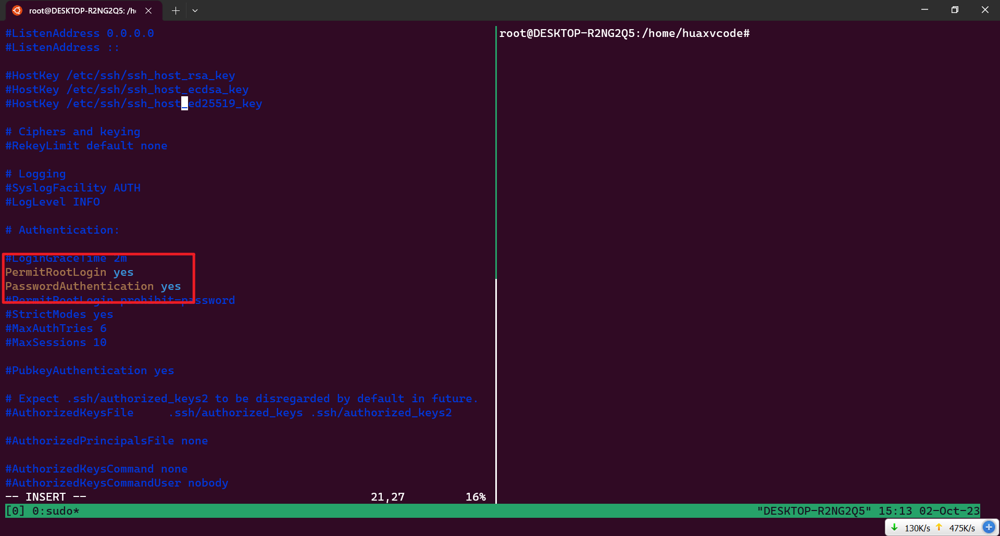

# vscode 连接 ubuntu20.04

## 安装 ubuntu20.04 子系统

powershell 运行：

```shell
dism.exe /online /enable-feature /featurename:Microsoft-Windows-Subsystem-Linux /all /norestart

dism.exe /online /enable-feature /featurename:VirtualMachinePlatform /all /norestart
```

## 查看 ubuntu 版本

```bash
lsb_release -a
```

## 换源

```shell
sudo su

vim /etc/apt/sources.list
```

复制清华源 (20.04)

```shell
# 清华镜像
# 默认注释了源码镜像以提高 apt update 速度，如有需要可自行取消注释
deb https://mirrors.tuna.tsinghua.edu.cn/ubuntu/ focal main restricted universe multiverse
# deb-src https://mirrors.tuna.tsinghua.edu.cn/ubuntu/ focal main restricted universe multiverse
deb https://mirrors.tuna.tsinghua.edu.cn/ubuntu/ focal-updates main restricted universe multiverse
# deb-src https://mirrors.tuna.tsinghua.edu.cn/ubuntu/ focal-updates main restricted universe multiverse
deb https://mirrors.tuna.tsinghua.edu.cn/ubuntu/ focal-backports main restricted universe multiverse
# deb-src https://mirrors.tuna.tsinghua.edu.cn/ubuntu/ focal-backports main restricted universe multiverse
deb https://mirrors.tuna.tsinghua.edu.cn/ubuntu/ focal-security main restricted universe multiverse
# deb-src https://mirrors.tuna.tsinghua.edu.cn/ubuntu/ focal-security main restricted universe multiverse

# 预发布软件源，不建议启用
# deb https://mirrors.tuna.tsinghua.edu.cn/ubuntu/ focal-proposed main restricted universe multiverse
# deb-src https://mirrors.tuna.tsinghua.edu.cn/ubuntu/ focal-proposed main restricted universe multiverse
```

## 更新源

```shell
sudo apt-get update
sudo apt-get upgrade
```

## 安装 openssh-server

```shell
sudo apt install openssh-server
```

## 开启服务

```shell
/etc/init.d/ssh start
```

## 修改 sshd_config

```shell
sudo vim /etc/ssh/sshd_config

Port 16608
PermitRootLogin yes
PasswordAuthentication yes

sudo /etc/init.d/ssh restart
```




## ifconfig 查看 ip 地址

```shell
apt install net-tools

ifconfig
```

## 快捷登陆，无密码，靠密钥

powershell 下运行

```shell
function ssh-copy-id([string]$userAtMachine, $args){   
    $publicKey = "$ENV:USERPROFILE" + "/.ssh/id_rsa.pub"
    if (!(Test-Path "$publicKey")){
        Write-Error "ERROR: failed to open ID file '$publicKey': No such file"            
    }
    else {
        & cat "$publicKey" | ssh $args $userAtMachine "umask 077; test -d .ssh || mkdir .ssh ; cat >> .ssh/authorized_keys || exit 1"      
    }
}
```

```shell
ssh-copy-id -p 16608 huaxvcode@127.0.0.1
```

## 登陆

powershell 下运行：

```shell
ssh -p 16608 huaxvcode@127.0.0.1
```

## vscode 下载插件

```
remote - ssh

remote explorer
```

## 连接


## 开启子系统自启动服务

在 c 盘下创建：`sshd.bat` 文件：

```shell
C:\Windows\System32\bash.exe -c "sudo /etc/init.d/ssh start"
```

将 `sshd.bat` 添加进任务计划程序中.

---

新建脚本：`sshd.vbs`，写入内容：

```shell
Set WinScriptHost = CreateObject("WScript.Shell")
WinScriptHost.Run Chr(34) & "C:\sshd.bat" & Chr(34), 0
Set WinScriptHost = Nothing
```

快捷键：`win+r`，输入：`shell:startup`

将 `sshd.vbs` 放进去

---

```shell
sudo visudo
```

在末尾添加：

```shell
%sudo ALL=NOPASSWD: /etc/init.d/ssh
```

然后：`ctrl+o`、`enter`、`ctrl+x`

## 下载编译环境

```shell
sudo su

sudo apt install build-essential manpages-dev software-properties-common gcc g++ make bison binutils gcc-multilib flex

sudo apt install openjdk-17-jre-headless
```

## 测试编译环境

```shell
gcc -v
g++ -v
python3
java -version
```
