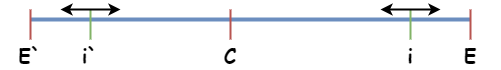
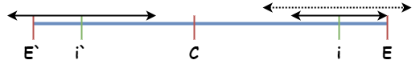
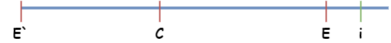
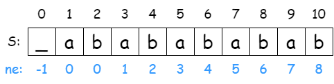

# 字符串知识汇总

- [字符串知识汇总](#字符串知识汇总)
  - [字符串哈希](#字符串哈希)
  - [二分哈希求最大回文子串](#二分哈希求最大回文子串)
  - [字符串哈希 - 暴力求最小循环节](#字符串哈希---暴力求最小循环节)
  - [Manacher 求最大回文子串](#manacher-求最大回文子串)
  - [KMP](#kmp)

## [字符串哈希](https://www.acwing.com/problem/content/843/)

求字符串的哈希值，进制一般取 $31、131、1313、13131、131313$

取模数一般都取质数：

```cpp
999998017 999998023 999998059 999998081 999998107 
999998119 999998137 999998141 999998143 999998147 
999998173 999998183 999998203 999998243 999998261 
999998269 999998309 999998339 999998369 999998423 
999998459 999998501 999998507 999998509 999998533 
999998537 999998563 999998609 999998617 999998621 
999998627 999998639 999998641 999998653 999998663 
999998683 999998687 999998689 999998693 999998777 
999998789 999998801 999998843 999998863 999998869 
999998903 999998917 999998921 999998929 999998957 
999998959 999998971 999998981 999999001 999999017 
999999029 999999043 999999059 999999067 999999103 
999999107 999999113 999999131 999999137 999999151 
999999163 999999181 999999191 999999193 999999197 
999999223 999999229 999999323 999999337 999999353 
999999391 999999433 999999487 999999491 999999503 
999999527 999999541 999999587 999999599 999999607 
999999613 999999667 999999677 999999733 999999739 
999999751 999999757 999999761 999999797 999999883 
999999893 999999929 999999937 1000000007 1000000009 
```

```cpp
namespace lrq {
    const ll N = 2e6;
    ll R1 = 31, R2 = 131313;
    ll M1 = 1e9 + 7, M2 = 1e9 + 9;
    std::pair<ll, ll> Hash(const std::string& s) {
        ll H1 = 0, H2 = 0;
        for (auto c : s) {
            H1 = (H1 * R1) % M1 + c; H1 %= M1;
            H2 = (H2 * R2) % M2 + c; H2 %= M2;
        }
        return {H1, H2};
    }
}
```

---

获取字符串某区间的哈希值：

```cpp
namespace lrq {
    const ll N = 2e6;
    ll R1 = 31, R2 = 131313;
    ll M1 = 1e9 + 7, M2 = 1e9 + 9;
    ll H1[N], H2[N]; // 字符串的哈希值
    ll P1[N], P2[N]; // 进制次方
    std::string s;   // 字符串从 1 开始
    ll n;            // 字符串的长度
    void init() {
        P1[0] = P2[0] = 1;
        for (ll i = 1; i <= n; i ++) {
            P1[i] = P1[i - 1] * R1 % M1;
            P2[i] = P2[i - 1] * R2 % M2;
            H1[i] = (H1[i - 1] * R1 % M1 + s[i]) % M1;
            H2[i] = (H2[i - 1] * R2 % M2 + s[i]) % M2;
        }
    }
    std::pair<ll, ll> get(ll l, ll r) {
        return {
            ((H1[r] - H1[l - 1] * P1[r - l + 1] % M1) % M1 + M1) % M1,
            ((H2[r] - H2[l - 1] * P2[r - l + 1] % M2) % M2 + M2) % M2
        };
    }
}
```

---

## [二分哈希求最大回文子串](https://leetcode.cn/problems/longest-palindromic-substring/description/)

给定一个长度为 $n$ 的字符串 $s$，求出该字符串的最大回文子串

字符串初始化：`sssssssss` 要处理成 `s#s#s#s#s#s#s#s#s`

```cpp
namespace lrq {
    const ll N = 2e6;
    ll R1 = 31, R2 = 131313;
    ll M1 = 1e9 + 7, M2 = 1e9 + 9;
    ll H1[N], H2[N];
    ll RH1[N], RH2[N];
    ll P1[N], P2[N];
    std::string s, ss;
    ll n, ssn;
    // 初始化，并处理出中心扩展字符串
    void init() {
        ss = ' ';
        for (long i = 1; i <= n; i ++) ss += s[i], ss += '#';
        ssn = n + n - 1;
        P1[0] = P2[0] = 1;
        for (ll i = 1; i <= ssn; i ++) {
            P1[i] = P1[i - 1] * R1 % M1;
            P2[i] = P2[i - 1] * R2 % M2;
            H1[i] = (H1[i - 1] * R1 % M1 + ss[i]) % M1;
            H2[i] = (H2[i - 1] * R2 % M2 + ss[i]) % M2;
        }
        for (ll i = ssn; i; i --) {
            RH1[i] = (RH1[i + 1] * R1 % M1 + ss[i]) % M1;
            RH2[i] = (RH2[i + 1] * R2 % M2 + ss[i]) % M2;
        }
    }
    // 获取 l -> r 的哈希值
    std::pair<ll, ll> get(ll l, ll r) {
        return {
            ((H1[r] - H1[l - 1] * P1[r - l + 1] % M1) % M1 + M1) % M1,
            ((H2[r] - H2[l - 1] * P2[r - l + 1] % M2) % M2 + M2) % M2
        };
    }
    // 获取 r -> l 的哈希值
    std::pair<ll, ll> rget(ll l, ll r) {
        return {
            ((RH1[l] - RH1[r + 1] * P1[r - l + 1] % M1) % M1 + M1) % M1,
            ((RH2[l] - RH2[r + 1] * P2[r - l + 1] % M2) % M2 + M2) % M2
        };
    }
    // 二分查找以 p 为中心的最大回文子串的长度
    ll find(ll p) {
        ll len = std::min(p, ssn - p + 1);
        ll l = 1, r = len, mid;
        while (l < r) {
            mid = (l + r + 1) >> 1;
            if (get(p, p + mid - 1) == rget(p - mid + 1, p)) l = mid;
            else r = mid - 1;
        }
        if (ss[p + l - 1] == '#') return l - 1;
        else return l;
    }
    // 获取以 p 为中心，长度为 len 的回文子串
    std::string get_s(long p, long len) {
        std::string res;
        for (ll i = p + 1; res.size() < (len >> 1); i ++) {
            if (ss[i] == '#') continue;
            res += ss[i];
        }
        auto t = std::string(res.rbegin(), res.rend());
        if (ss[p] != '#') t += ss[p];
        return t + res;
    }
}
```

---

## [字符串哈希 - 暴力求最小循环节](https://ac.nowcoder.com/acm/contest/42400/M)

给定一个字符串 $S = TTTTTTTTTT\cdots$

请求出长度最小的满足上述式子的字符串 $T$

暴力枚举循环节可能的长度 $len = 1, 2, \cdots \frac{n}{2}, n$，暴力判断字符串 $S$ 是否由长度为 $len$ 的子串循环构成

时间复杂度：$\frac{n}{1} + \frac{n}{2} + \frac{n}{3} + \cdots + \frac{n}{n} < n\log(n)$

```cpp
namespace lrq {
    const ll N = 2e6;
    ll R1 = 31, R2 = 131313;
    ll M1 = 1e9 + 7, M2 = 1e9 + 9;
    ll H1[N], H2[N]; // 字符串的哈希值
    ll P1[N], P2[N]; // 进制次方
    std::string s;   // 字符串从 1 开始
    ll n;            // 字符串的长度
    void init() {
        P1[0] = P2[0] = 1;
        for (ll i = 1; i <= n; i ++) {
            P1[i] = P1[i - 1] * R1 % M1;
            P2[i] = P2[i - 1] * R2 % M2;
            H1[i] = (H1[i - 1] * R1 % M1 + s[i]) % M1;
            H2[i] = (H2[i - 1] * R2 % M2 + s[i]) % M2;
        }
    }
    std::pair<ll, ll> get(ll l, ll r) {
        return {
            ((H1[r] - H1[l - 1] * P1[r - l + 1] % M1) % M1 + M1) % M1,
            ((H2[r] - H2[l - 1] * P2[r - l + 1] % M2) % M2 + M2) % M2
        };
    }
    std::string get_loop(ll& len) {
        len = 1;
        while (len < n) {
            auto hs = get(1, len);
            for (ll i = 1; i + len - 1 <= n; i += len) {
                if (get(i, i + len - 1) != hs) {
                    len ++; goto lab;
                }
            }
            break;
            lab:;
        }
        if (len > n / 2) len = n;
        return std::string(s.begin() + 1, s.begin() + 1 + len);
    }
}
```

## [Manacher 求最大回文子串](https://leetcode.cn/problems/longest-palindromic-substring/description/)

推导如下：

默认情况下，需要对每一个下标暴力中心扩展回文串的最大长度

在暴力的前提下，对速度进行改良，利用回文串镜像对称的特性，减少暴力扩展的步骤：

情况 1：



如果 $i$ 关于 $c$ 的对称点 $i^\prime$ 的回文子串在 $E^\prime \sim E$ 内，则立马就可以推导出 $i$ 的回文子串的长度也会是 $i^\prime$ 的回文子串的长度（$i^\prime$ 不同的两个端点也镜像复制到 $i$ 那边去了）；

情况 2：



如果 $i$ 关于 $c$ 的对称点 $i^\prime$ 的回文子串存在某部分使得 $E^\prime \sim E$ 装不下了（超出了左边界），则镜像对称之后的 $i$，只有 $i \sim E$ 这部分是关于 $i$ 对称的回文子串是可以确定的，是否还会更长，只可以用暴力中心扩展他的长度。

情况 3：



如果 $i$ 超出了 $c$ 的回文子串的右边界（$i$ 超出了 $E$），则只能对 $i$ 暴力中心扩展他的长度，并将 $c$ 更新为 $i$，$E$ 更新为 $i$ 回文串的右边界（为什么需要更新，只有更新后，$E$ 才能更加的靠右，只有更加的靠右才能更多的节省推导某些节点的回文串的长度）

---

时间复杂度：$O(n)$

```cpp
namespace lrq {
    ll n;
    std::string s; // 字符串从下标 1 开始
    ll ssn;
    std::string ss;
    ll P[N]; // 以 i 为中心的最大回文子串的长度
    ll C, R; // C 代表回文串的中心位置，R 代表回文串最右边元素的下标+1
    void init() {
        ss = '?'; 
        ss += '#';
        for (ll i = 1; i <= n; i ++) {
            ss += s[i]; ss += '#';
        }
        ss += '!';
        ssn = 3 + 2 * n;
    }
    void manacher() {
        C = R = 0;
        for (ll i = 1; i <= ssn; i ++) {
            if (i <= R) P[i] = std::min(P[2 * C - i], P[C] + C - i);
            else P[i] = 1;
            while (ss[i + P[i]] == ss[i - P[i]]) P[i] ++;
            if (i + P[i] > R) {
                R = i + P[i];
                C = i;
            }
        }
    }
    ll cnt_char(ll l, ll r) {
        if (ss[l] == '#' && ss[r] == '#') return (r - l) >> 1;
        else if (ss[l] == '#' || ss[r] == '#') return (r - l + 1) >> 1;
        else return (r - l + 2) >> 1;
    }
    // 获取回文串在原字符串的下标，回文串的长度，回文串
    void get(ll& center, ll& len, std::string& s) {
        len = 0;
        std::string res;
        for (ll i = 1; i <= ssn; i ++) {
            auto t = cnt_char(i - P[i] + 1, i + P[i] - 1);
            if (t > len) {
                len = t;
                center = i;
            }
        }
        for (ll i = center + 1, j = 0; j < (len >> 1); i ++) {
            if (ss[i] == '#') continue;
            else res += ss[i], j ++;
        }
        s = std::string(res.rbegin(), res.rend());
        if (ss[center] != '#') s += ss[center];
        s += res;
    }
}
```

## KMP



字符串 $s$ 默认是从下标 $1$ 开始记起

$ne[i]$ 代表 $s[1 \sim i]$ 的最大相同前后缀的长度，所以如果 $s[i] \neq s[j]$ 时，有子串 $s[1 \sim i - 1]$ 和 $s[j - i + 1 \sim j - 1]$ 是匹配成功的，**所以 $i$ 需要跳到 $ne[i - 1] + 1$ 处**

循环节的长度：$n - ne[n]$

```cpp
namespace lrq {
    const ll N = 2e6;
    std::string s, ss; // s 为模式串，ss 为匹配串
    ll n, m; // s 的长度，ss 的长度，都是从 1 开始
    ll ne[N];
    void kmp() {
        ll i = 0, j = 1; 
        ne[0] = -1;
        ne[1] = 0;
        while (j <= n) {
            if (i == 0 || s[i] == s[j]) {
                ne[j ++] = i ++;
            }
            else i = ne[i - 1] + 1;
        }
    }
    // 统计 s 在 ss 中出现的位置
    std::vector<ll> strcmp() {
        std::vector<ll> pos;
        ll i = 1, j = 1;
        while (j <= m) {
            if (i == 0 || s[i] == ss[j]) {
                if (i == n) {
                    pos.push_back(j - n + 1);
                    i = ne[i - 1] + 1;
                }
                else i ++, j ++;
            }
            else i = ne[i - 1] + 1;
        }
        return pos;
    }
    // 最小循环节的长度
    ll strloop() {
        ll t = n - ne[n];
        return t > n / 2 ? n : t;
    }
}
```
