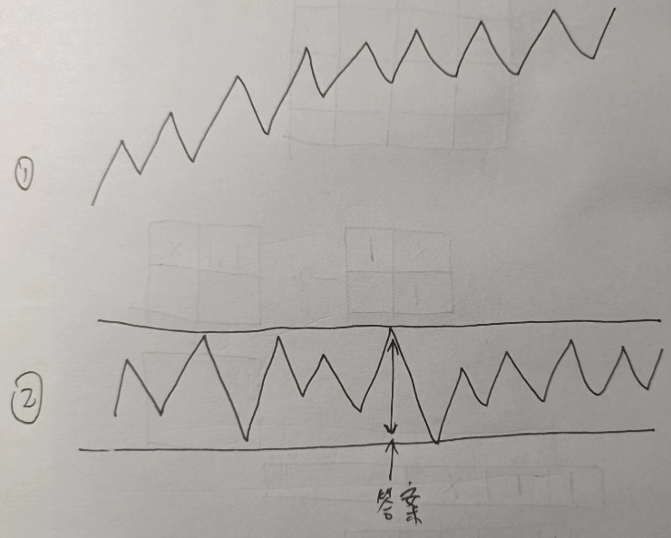

# [B. Comparison String](https://codeforces.com/problemset/problem/1837/B)



```cpp
#include <bits/stdc++.h>
#define long long long
#define bint __int128

long n; std::string s;

void solve() {
    std::cin >> n >> s;
    s = ' ' + s;
    long l = 1, r = 1, p = 1;
    long res = 1;
    while (r <= n) {
        while (r <= n && s[r] == s[p]) r ++;
        res = std::max(res, r - l + 1);
        l = p = r;
    }
    std::cout << res << '\n';
} 

// g++ -std=c++20 Main.cpp -o Main && ./Main
int main() {
    std::ios::sync_with_stdio(0);
    std::cin.tie(0); std::cout.tie(0);
    long t; std::cin >> t; while (t --)
    solve();
    return 0;
}

```