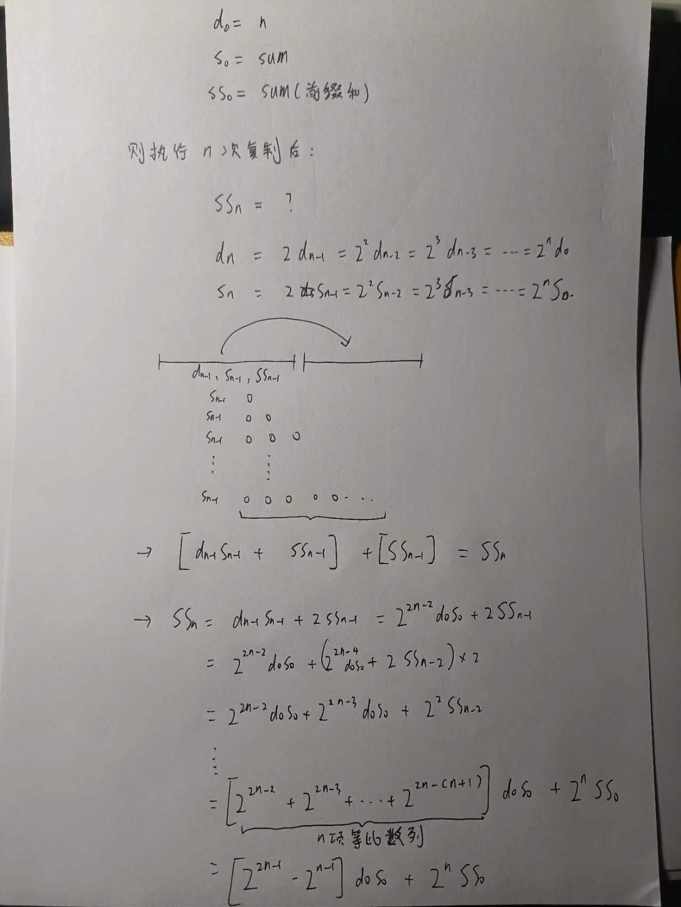
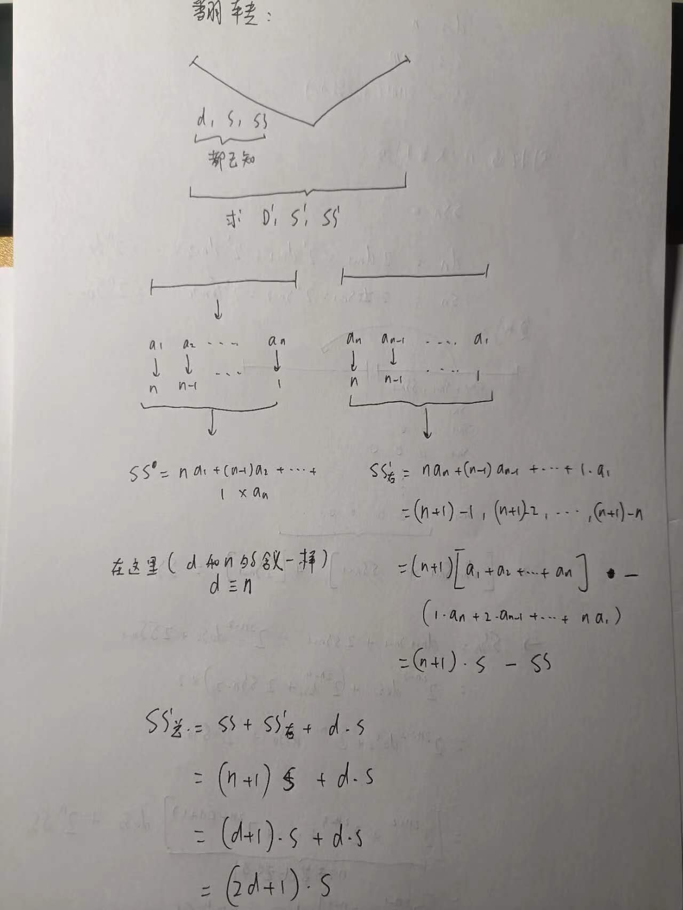

# [C. Array Concatenation](https://codeforces.com/gym/104008/problem/C)

推导题，过程看草稿吧：





```cpp
#include <bits/stdc++.h>
#define long long long
#define bint __int128

namespace code {
    
const long N = 2e5;
const long mod = 1e9 + 7;
long n, m;
long a[N];
long d, s, ss;
long res;

bint qpow(bint a, bint b, bint mod) {
    a = a % mod;
    bint ans = 1;
    while (b) {
        if (b & 1) ans = ans * a % mod;
        a = a * a % mod;
        b >>= 1;
    }
    return ans;
}

void solve() {
    std::cin >> n >> m;
    for (long i = 1; i <= n; i ++) {
        std::cin >> a[i];
        s = (s + a[i]) % mod;
        ss = (ss + s) % mod;
    }
    d = n;
    
    auto f1 = [&](bint t, bint d, bint s, bint ss) -> bint {
        d %= mod; s %= mod; ss %= mod;
        bint res = qpow(2, 2 * t - 1, mod) - qpow(2, t - 1, mod);
        res = (res % mod + mod) % mod;
        res = (res * d) % mod;
        res = (res * s) % mod;
        res = (res + qpow(2, t, mod) * ss % mod) % mod;
        return res; 
    };

    auto f2 = [&](bint d, bint s, bint ss) -> bint {
        d %= mod; s %= mod; ss %= mod;
        // return (((d + 1) * s % mod - ss) % mod + mod) % mod;
        bint res = (d + 1) * s % mod;
        res = (res + d * s % mod) % mod;
        return res;
    };
    
    res = f1(m, d, s, ss);
    {
        long ss_ = f2(d, s, ss);
        long d_ = d * 2 % mod;
        long s_ = s * 2 % mod;
        if (m > 1) {
            long t = m - 1;
            ss_ = f1(t, d_, s_, ss_);
            res = std::max(res, ss_);
        }
        else res = std::max(res, ss_);
    }
        
    for (long i = 1; i < m; i ++) {
        long ss_ = f1(i, d, s, ss);
        long d_ = qpow(2, i, mod) * d % mod;
        long s_ = qpow(2, i, mod) * s % mod;
        ss_ = f2(d_, s_, ss_);
        d_ = 2 * d_ % mod;
        s_ = 2 * s_ % mod;
        if (i == m - 1) {
            res = std::max(res, ss_);
        }
        else {
            long t = m - i - 1;
            ss_ = f1(t, d_, s_, ss_);
            res = std::max(res, ss_);
        }
    }
    std::cout << res << '\n';
}
    
}

// g++ -std=c++20 Main.cpp -o Main && ./Main
int main() {
    std::ios::sync_with_stdio(0);
    std::cin.tie(0); std::cout.tie(0);
    //long t; std::cin >> t; while (t --)
    code::solve();
    return 0;
}

```